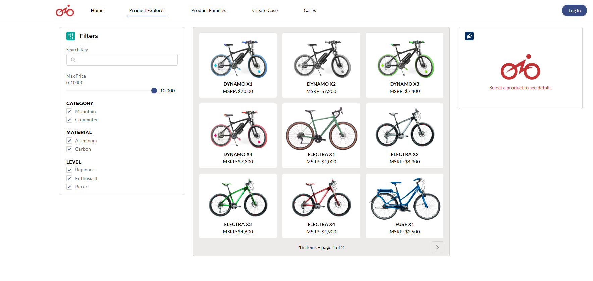
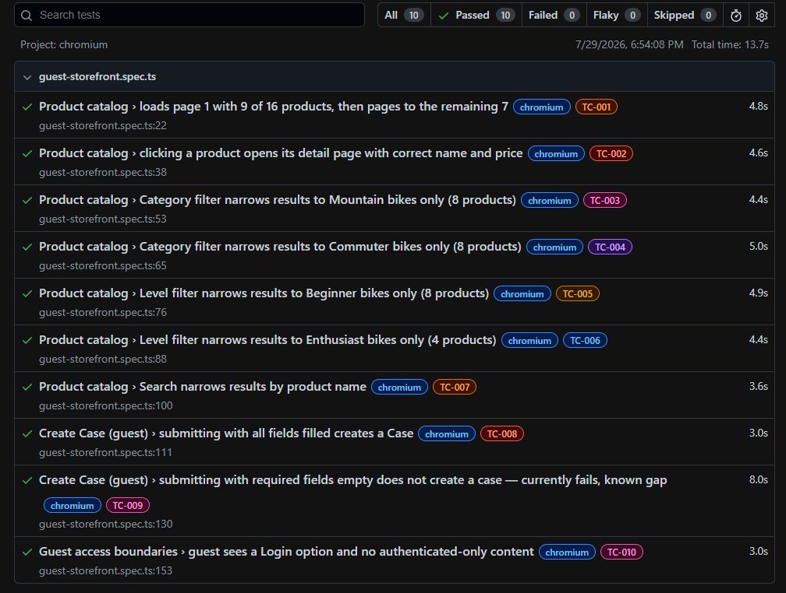

# Salesforce E-Bikes Test Automation

Playwright-based test automation suite targeting the [E-Bikes LWC](https://github.com/trailheadapps/ebikes-lwc) sample application (Salesforce, Lightning Web Components + Experience Cloud), deployed to a personal Salesforce Developer Edition org.

Tests are written in **TypeScript** using **Playwright Test**, Playwright's built-in test runner, and run across the Chromium, Firefox, and WebKit engines. Each test case is tagged with a stable `@TC-###` ID (independent of its title) for CLI filtering and traceability, and every run produces an HTML report — full-page screenshots, failure video, and trace data included — for visual verification alongside the pass/fail result:

## Contents

- `/guides` — step-by-step documentation of environment setup, Salesforce org configuration, application deployment, and test automation strategy
- `/tests` — Playwright test suite

## Guides

1. [Environment & Tool Installation](guides/01-environment-setup.md)
2. [Playwright Test Plan](guides/02-test-plan.md)
3. [Requirements Traceability](guides/03-requirements-traceability.md)
4. [Authentication & Test Session Strategy](guides/04-authentication-test-session-strategy.md)
5. [Visual Reporting & Trace Debugging](guides/05-visual-reporting-and-debugging.md)

## About This Project

This project demonstrates two things end-to-end:
1. Standing up a real Salesforce environment from source — CLI tooling, org configuration, metadata deployment, and troubleshooting real deployment issues.
2. Building automated test coverage against that environment using Playwright.
