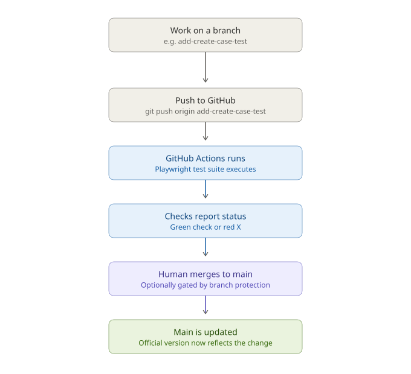
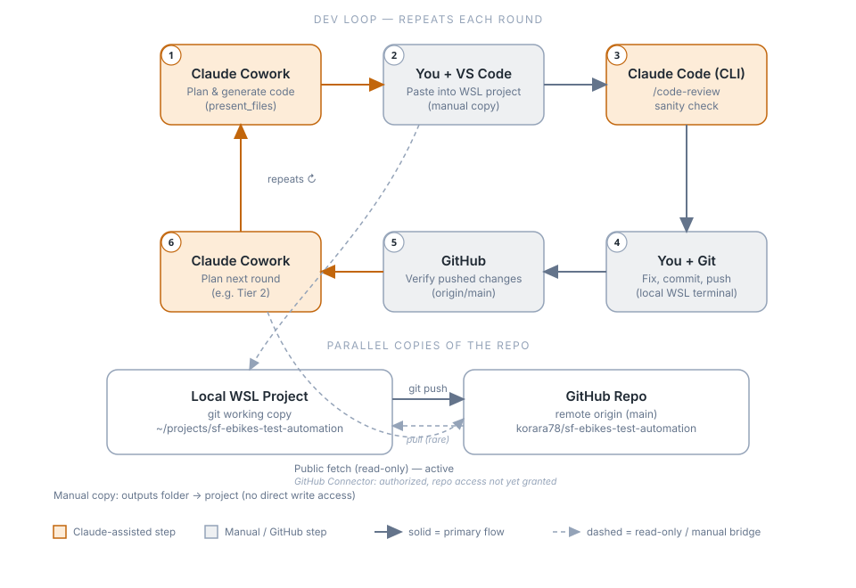

# Guide 1: Environment & Tool Installation

**Project:** Salesforce LWC Test Automation Portfolio (E-Bikes)
**Author:** [Your Name]
**Last updated:** 2026-07-26
**Status:** ✅ Complete

---

## Overview

This guide documents the installation and configuration of every account and tool needed to build a Playwright-based test automation suite against Salesforce's [E-Bikes LWC](https://github.com/trailheadapps/ebikes-lwc) sample application. It is the first guide in a series documenting this project end-to-end, from environment setup through test design and CI integration.

**Goal of this guide:** By the end, you will have a working Salesforce Developer org, the E-Bikes sample app deployed to it, and a Playwright test project scaffolded and ready for automation.

**Why this project:** E-Bikes is Salesforce's own reference application for Lightning Web Components, actively maintained by Salesforce. Using it as a test target demonstrates QA/SDET skills against a realistic, enterprise-style Salesforce UI rather than a toy app.

---

## Prerequisites

| Requirement | Notes |
|---|---|
| Free Salesforce Developer Edition org | No credit card required |
| GitHub account | Used to host this documentation and the test repo |
| Admin rights on your local machine | Needed to install Node.js, Git, VS Code |
| ~1–2 hours | For a first-time, unhurried setup |

---

## Step 1 — Create Accounts

### 1.1 Salesforce Developer Edition Org
1. Go to [developer.salesforce.com/signup](https://developer.salesforce.com/signup).
2. Fill in the signup form using a personal email address (this org is yours to keep).
3. Choose a unique username in email format — this does **not** need to match your real email address, and Salesforce usernames must be globally unique across all Salesforce orgs.
4. Verify your email and log in to confirm the org is active.

> 📸 *Screenshot: Salesforce signup confirmation email*
> 📸 *Screenshot: First login to the Developer org, Lightning Experience home page*

### 1.2 GitHub Account
1. If you don't already have one, create an account at [github.com](https://github.com).
2. Create a new repository to host this documentation and your test code (e.g., `sf-ebikes-test-automation`).

---

## Step 2 — Install Core Local Tools

**Environment decision:** Node-based CLI tooling (Salesforce CLI, npm, Playwright) is installed and run inside **WSL (Windows Subsystem for Linux)** rather than natively on Windows. This avoids Windows-specific path, permissions, and shell-scripting issues that commonly affect Node global installs and Playwright's browser binaries, and it keeps the toolchain consistent with what a Linux-based CI runner would use later.

| Tool | Purpose | Install Source |
|---|---|---|
| WSL 2 + a Linux distro (Ubuntu) | Linux environment for all CLI tooling below | Windows built-in (`wsl --install`) |
| Node.js + npm (LTS) | Runs Playwright and LWC build tooling | Installed inside WSL via `nvm` |
| Salesforce CLI (`sf`) | Deploy the app, manage orgs, push/pull metadata | `npm install --global @salesforce/cli` (inside WSL) |
| Git | Clone the E-Bikes repo | Installed inside WSL via `apt` |
| VS Code | Standard Salesforce dev editor | [code.visualstudio.com](https://code.visualstudio.com) (installed on Windows, connected to WSL) |
| Salesforce Extension Pack | LWC syntax, Apex support, org browser, deploy-on-save | VS Code Extensions Marketplace |

### 2.1 Install WSL

From an elevated **PowerShell** window on Windows:

```powershell
wsl --install
```

This installs WSL 2 and defaults to an Ubuntu distribution. Restart when prompted, then complete the Ubuntu first-run setup (create a Linux username/password).

> 📸 *Screenshot: PowerShell output of `wsl --install` completing*
> 📸 *Screenshot: Ubuntu terminal after first-run setup*

Confirm the WSL version in use:

```powershell
wsl -l -v
```

Ubuntu should show as `VERSION 2`.

### 2.2 Install Git inside WSL

Open the Ubuntu terminal (search "Ubuntu" in the Start menu) and run:

```bash
sudo apt update
sudo apt install -y git
```

### 2.3 Install Node.js (LTS) via nvm

Using `nvm` (Node Version Manager) instead of `apt` avoids permission issues with global npm installs and makes it easy to switch Node versions later:

```bash
curl -o- https://raw.githubusercontent.com/nvm-sh/nvm/v0.40.1/install.sh | bash
source ~/.bashrc
nvm install --lts
```

### 2.4 Install the Salesforce CLI

```bash
npm install --global @salesforce/cli
```

### Verification commands

Run each of the following inside the **WSL/Ubuntu terminal** to confirm a successful install:

```bash
node -v
npm -v
git --version
sf --version
```

> 📸 *Screenshot: WSL terminal output showing all four version checks passing*

### 2.5 Install VS Code and connect it to WSL

VS Code itself is installed on Windows as normal, then connected into the WSL filesystem so all editing, terminals, and extensions run in the same Linux environment as the CLI tools above.

1. Install VS Code on Windows: [code.visualstudio.com](https://code.visualstudio.com).
2. Install the **WSL** extension (by Microsoft) from the VS Code Extensions Marketplace.
3. From the Ubuntu terminal, navigate to your project folder and launch VS Code connected to that WSL context:

```bash
code .
```

This opens VS Code in "WSL: Ubuntu" mode, shown in the bottom-left corner of the window.

> 📸 *Screenshot: VS Code bottom-left status bar showing "WSL: Ubuntu"*

### 2.6 Install the Salesforce Extension Pack

1. In VS Code (connected to WSL), open Extensions (`Ctrl+Shift+X`).
2. Search for **Salesforce Extension Pack**.
3. Click **Install** — because VS Code is in WSL mode, this installs the extension into the WSL environment, matching where the `sf` CLI actually lives.

> 📸 *Screenshot: Salesforce Extension Pack listing in the VS Code Marketplace*

---

## Step 3 — Clone and Deploy the E-Bikes Sample App

### 3.1 Authorize your Developer org

```bash
sf org login web -s -a mydevorg
```

This opens a browser window for login; on success, the org is set as your default and aliased as `mydevorg`.

> **Note:** Use `-s` (set as default) with `-a mydevorg` for a straightforward Developer Edition org login. The `-d` flag is reserved for authorizing a **Dev Hub** specifically, which is only needed if you go the scratch-org route in Step 3.3 below.

> 📸 *Screenshot: Successful "Org login successful" terminal message*

### 3.2 Clone the repository

```bash
git clone https://github.com/trailheadapps/ebikes-lwc
cd ebikes-lwc
npm install
```

`npm install` pulls in the project's linting, formatting, and LWC test tooling — not the app itself, which is deployed via `sf`.

### 3.3 Deploy to a Developer Edition org

The repository README supports two paths:

- **Developer Edition org (recommended for this project)** — simpler, no Dev Hub required. Good for getting a stable, always-on org to test against.
- **Scratch org** — cleaner and disposable, better suited to CI pipelines later on, but requires Dev Hub to be enabled first.

> **Decision for this project:** Developer Edition org — chosen for a persistent, stable UI to build repeatable Playwright tests against.

The full README is the source of truth for exact commands (they can shift with CLI versions): [ebikes-lwc README](https://github.com/trailheadapps/ebikes-lwc/blob/main/README.md). The sequence below is the concrete, verified path for a fresh Developer Edition org.

**a) Register a My Domain** (required before Digital Experiences can be enabled, and often not yet set up on a brand-new org)
1. Setup → Quick Find → **My Domain**
2. Enter a unique domain name (e.g., `yourname-ebikes-dev`) → **Check Availability** → **Register Domain**
3. Wait for provisioning (a few minutes), then **Deploy to Users**
4. If deploy shows a network connectivity warning immediately after registering, this is usually just DNS propagation lag — wait a few minutes and retry; don't undo the registration

> 📸 *Screenshot: My Domain Details page showing the deployed domain*

**b) Complete MFA setup if prompted**
Salesforce requires Multi-Factor Authentication org-wide. If you're prompted to register a verification method (mobile app or SMS) after the domain deploy forces a re-login, complete it — this is a one-time setup per user.

**c) Enable Digital Experiences**
1. Setup → Quick Find → **Digital Experiences** → **Settings**
2. Check **Enable Digital Experiences** → **Save** → **OK**
3. On the same page, scroll to **Experience Management Settings**
4. Check **Enable ExperienceBundle Metadata API** → **Save**

> **Both checkboxes are required.** Missing the second one causes the deploy to fail later with an `ExperienceBundle isn't enabled for Aura sites` error — see Troubleshooting below.

**d) Edit the site metadata file**

Get your org username first:
```bash
sf org display -o mydevorg
```

Open `force-app/main/default/sites/E_Bikes.site-meta.xml` in VS Code and update:
- `<siteAdmin>` → your org username
- `<siteGuestRecordDefaultOwner>` → your org username
- `<subdomain>` → just your domain name from step (a), no URL/protocol

Save the file.

**e) Case object field check**

The README instructs removing a `Product` custom field from the `Case` object. In current Developer Edition orgs, this field is frequently a **standard** field (Data Type `Lookup(Product)`, no `__c` suffix) rather than the custom picklist the README originally described — standard fields cannot be deleted through the UI. If you find it's a standard field, **skip this step** and proceed to deploy; the deploy will succeed regardless (confirmed: 101/101 components deployed with this field left untouched).

**f) Deploy the app**
```bash
sf project deploy start -d force-app
sf org assign permset -n ebikes
sf data tree import -p ./data/sample-data-plan.json
sf community publish -n E-Bikes
sf project deploy start --metadata-dir=guest-profile-metadata -w 10
```

> **Sample data import note:** if `sf data tree import` fails with `FIELD_INTEGRITY_EXCEPTION` on `BillingCountry` or `BillingState`, your org has **State and Country/Territory Picklists** enabled (Setup → State and Country/Territory Picklists). This requires full country/state names rather than abbreviations in the data file — see Troubleshooting below for the exact fix.

**g) Open the org and finish setup**
```bash
sf org open
```
In **Setup → Themes and Branding**, activate **Lightning Lite**. In App Launcher, select the **E-Bikes** app.

> 📸 *Screenshot: Terminal output of `sf project deploy start` completing successfully*
> 📸 *Screenshot: E-Bikes app visible and functional inside the Salesforce org (App Launcher → E-Bikes)*

### 3.4 Manual sanity check

Before writing any automation, walk through the E-Bikes app manually in the browser:
- Confirm the product catalog loads.
- Confirm you can view a product detail page.
- Confirm the "Create Case" component works.

### 3.5 Deployment Summary

The following summarizes what was built and deployed in this phase:

1. Configured a Linux-based development environment (WSL 2 / Ubuntu) alongside VS Code and Git, used to run the Salesforce CLI and manage source control for the project.
2. Provisioned a Salesforce Developer Edition org — a free, full-featured, isolated Salesforce instance — and secured it with a registered custom domain and Multi-Factor Authentication.
3. Retrieved the E-Bikes sample application source (Lightning Web Components, Apex classes, custom objects, and Experience Cloud site configuration) from its public GitHub repository.
4. Enabled Digital Experiences, the Salesforce platform capability required to build and publish public-facing Experience Cloud sites.
5. Deployed the application's metadata to the org, provisioning the underlying data model (`Product__c`, `Product_Family__c`, `Order__c`, `Order_Item__c`), Lightning Web Components, Apex controllers, and the Experience Cloud site bundle, then published the site. The application and site are hosted entirely on Salesforce's infrastructure under the Developer org — the local environment was used only to build and deploy, not to run the application.
6. Imported sample business data (accounts, product families, and individual products) to populate the environment with realistic records.
7. Validated the deployment through manual verification of both the internal Lightning application (data records, product catalog) and the public-facing guest storefront (product browsing, case submission), confirming the environment is fully functional end-to-end.

**Outcome:** a working, data-populated Salesforce application — Lightning Web Components, Apex backend, and a live public storefront — deployed from source and ready as a target for automated test coverage.

This step matters — understanding real application behavior first leads to better test assertions later.

---

## Step 4 — Scaffold Playwright

Playwright is installed as a separate concern from the E-Bikes app itself, either inside the same project or in a dedicated `/tests` directory.

```bash
npm init playwright@latest
```

This scaffolds:
- `playwright.config.ts` — test runner configuration
- `/tests` — default test folder
- Browser binaries (Chromium, Firefox, WebKit)

> 📸 *Screenshot: Playwright scaffold CLI prompts and final "Success" message*
> 📸 *Screenshot: Resulting project folder structure in VS Code*

---

## Step 5 — Salesforce-Specific Test Setup (Preview)

Salesforce's login flow (including SSO/MFA) makes logging in on every test slow and brittle. The standard fix is a **storage state** setup file that authenticates once and reuses the session across the test suite.

This is covered in detail in **Guide 3: Authentication & Test Session Strategy**, but the file involved is:

```
auth.setup.ts
```

which uses Playwright's `storageState` feature to persist a logged-in session.

---

## Verification Checklist

Use this checklist to confirm the environment is fully ready before moving to Guide 2:

- [ ] Salesforce Developer org created and accessible
- [ ] GitHub repository created for this project
- [ ] WSL 2 + Ubuntu installed and confirmed via `wsl -l -v`
- [ ] `node -v`, `npm -v`, `git --version`, `sf --version` all return valid versions **inside WSL**
- [ ] VS Code installed on Windows, connected to WSL (status bar shows "WSL: Ubuntu")
- [ ] Salesforce Extension Pack installed inside the WSL VS Code context
- [ ] `sf org login web -s -a mydevorg` succeeds
- [ ] My Domain registered and deployed
- [ ] MFA registered (if prompted)
- [ ] Digital Experiences **and** ExperienceBundle Metadata API both enabled
- [ ] `E_Bikes.site-meta.xml` updated with correct username and subdomain
- [ ] `ebikes-lwc` repo cloned and `npm install` completed without errors
- [ ] `sf project deploy start -d force-app` succeeds (101/101 components)
- [ ] `ebikes` permission set assigned
- [ ] Sample data imported successfully (adjust `BillingCountry`/`BillingState` values if needed)
- [ ] Experience Cloud site published and guest profile metadata deployed
- [ ] E-Bikes app deployed and manually verified in the org
- [ ] Playwright scaffolded with `npm init playwright@latest`

---

## Troubleshooting Notes

| Issue | Likely Cause | Fix |
|---|---|---|
| `AuthTimeoutError` on `sf org login web` | Browser handoff from WSL to Windows didn't complete in time | Retry the command; if it recurs, try `SF_LOGIN_URL_TIMEOUT=120 sf org login web -s -a mydevorg` or force a specific browser with `--browser chrome` |
| My Domain deploy shows "your network doesn't allow access to these domains" right after registering | DNS propagation lag on a freshly registered domain — not a real network issue | Wait a few minutes, refresh the My Domain page, retry **Deploy to Users**. Don't undo the domain registration. |
| Deploy fails: `ExperienceBundle isn't enabled for Aura sites` | Only "Enable Digital Experiences" was saved; "Enable ExperienceBundle Metadata API" checkbox was missed | Setup → Digital Experiences → Settings → scroll to Experience Management Settings → check **Enable ExperienceBundle Metadata API** → Save → retry deploy |
| No **Delete** button on the `Product` field on Case | Field is a **standard** field in this org (no `__c` suffix), not the custom picklist the README describes; standard fields can't be deleted via the UI | Skip this step and proceed to deploy — confirmed to deploy successfully (101/101 components) with the field left in place |
| `sf data tree import` fails with `FIELD_INTEGRITY_EXCEPTION` on `BillingCountry` | Org has **State and Country/Territory Picklists** enabled (Setup → State and Country/Territory Picklists), which requires exact picklist label matches, not abbreviations like `"USA"` | Edit `data/Accounts.json`, replace abbreviations with full names, e.g.: `sed -i 's/"BillingCountry": "USA"/"BillingCountry": "United States"/g' data/Accounts.json` |
| Same error on `BillingState` after fixing `BillingCountry` | Same picklist restriction applies to state abbreviations (e.g., `"CA"`, `"MA"`, `"NY"`) | Same fix pattern, e.g.: `sed -i 's/"BillingState": "CA"/"BillingState": "California"/g' data/Accounts.json` — repeat per state code present in the file |
| `code .` doesn't open VS Code from WSL | WSL extension not installed, or VS Code not on Windows PATH | Install the "WSL" extension in VS Code on Windows; reopen the Ubuntu terminal |
| Project files feel slow to load/build | Project stored on the Windows filesystem (`/mnt/c/...`) instead of the Linux filesystem | Clone/keep the project under the Linux home directory (e.g., `~/projects/`), not `/mnt/c/...` |
| `sf` command not found after install | npm global bin not on PATH | Restart terminal, or add npm global bin directory to PATH |
| Org login browser window doesn't open | Default browser/session issue | Retry with `sf org login web -s -a mydevorg --browser chrome` |
| Deploy fails referencing Experience Cloud / community metadata | Digital Experiences not enabled in org | In Setup → Digital Experiences, enable, then retry deploy per README |
| `npm install` errors on Playwright scaffold | Outdated Node.js version | Confirm Node.js LTS via `node -v`; reinstall if below supported minimum |

---

## Appendix A: What is npm?

**npm** (Node Package Manager) is the tool that installs, manages, and updates third-party code packages that a project depends on. It ships bundled with Node.js.

**Analogy:** `package.json` is a recipe, and `npm install` is going shopping for every ingredient on that recipe (and every ingredient those ingredients need, cascading down).

- **`package.json`** — the list itself. It names each package the project depends on, plus which version. It's checked into the project (you'll see it sitting right in the `ebikes-lwc` folder, and later in your Playwright folder).
- **`npm install`** — reads that list and fetches every package named in it (downloading from the npm registry), then places them all into a `node_modules` folder.
- **`node_modules`** — the actual downloaded ingredients, sitting locally in that project folder, ready to be used.

**Why it matters in this project:** every folder with its own `package.json` needs its own `npm install` run inside it — the E-Bikes app, and later the Playwright test project, each have their own independent dependency lists and their own `node_modules`. Running `npm install` in one has no effect on the other, which is why the same command shows up more than once across this guide.

---

## Appendix B: Git Command Reference (Mapped to eQMS Concepts)

For readers coming from a document-control / eQMS background (e.g., draft, check-in, check-out, change control), the table below maps that mental model onto the core Git commands used throughout this guide series. The mapping is a helpful starting point, not a literal equivalence — see the notes below the table for where the two models diverge.

| eQMS Concept | Git Command | What It Does |
|---|---|---|
| Retrieve a copy of a controlled document/repository for the first time | `git clone <url>` | Downloads a full copy of a remote repository, including its entire history |
| Check current status of a draft (what's changed, what's pending) | `git status` | Shows what's changed, staged, and which branch you're on |
| Review revision history | `git log` | Shows the full commit history |
| Review exact line-level redlines not yet finalized | `git diff` | Shows line-by-line changes not yet staged |
| Add specific edits to be included in the next save point | `git add <file>` | Stages a file's changes for the next commit (`git add .` stages everything) |
| Save a draft version locally | `git commit -m "message"` | Locks in a snapshot **locally**, with a description of what changed |
| Check in a draft to the shared/controlled system | `git push` | Publishes local commits to the remote repository (e.g., GitHub) |
| Check out the current shared/controlled version | `git pull` | Fetches and merges the latest changes from the remote repository |
| List available draft versions/change branches | `git branch` | Lists all branches in the repository |
| Create a new working draft split off from the current version | `git checkout -b <branch-name>` | Creates and switches to a new branch |
| Switch between existing draft versions | `git checkout <branch-name>` | Switches to an existing branch |
| Route a change-control draft back into the master/approved document | `git merge <branch-name>` | Merges another branch's changes into the current branch |
| Discard unsaved edits, reverting to the last saved draft | `git restore <file>` | Discards uncommitted changes to a file |
| Remove edits from the "to be saved" queue without discarding them | `git reset` | Unstages files without deleting the underlying changes |

### Core concepts confirmed

- `main` is the current, official version of the project.
- A branch is a parallel effort/timeline, developed in isolation from `main`.
- Many branches can exist simultaneously, each representing separate, independent work.
- A merge combines a parallel branch back into `main` (or any other target branch), reconciling the two timelines.
- A push moves local commits — on any branch — up to GitHub; it does not by itself decide or trigger a merge.
- GitHub Actions, if configured, runs automated checks (such as a test suite) against a push; it reports pass/fail but does not perform the merge itself.

### Push → CI check → merge flow

The table above covers individual commands. The diagram below shows how they combine into the actual workflow used once GitHub Actions (CI) is involved — the sequence that runs every time a branch is pushed:



A few things worth being precise about in this flow:
- **GitHub Actions doesn't decide anything** — it only runs checks (in this project's case, the Playwright test suite) and reports pass/fail. It never modifies a branch or performs a merge on its own.
- **The merge decision is a human one**, made after reviewing the check result — ideally, only merging when the checks pass.
- **Branch protection** (a separate, optional GitHub setting) can enforce that decision by disabling the merge button until the required check passes — turning the human judgment call into an automatically enforced rule.

### Where the analogy breaks down

- **No lock on check-out.** eQMS check-out typically locks a document so only one person can edit it at a time. `git pull` never locks anything — multiple people can edit their own local copies of the same file simultaneously. Conflicts are resolved manually at commit/push time rather than prevented up front.
- **Commit is "Save As," not "Save."** Each commit is a new, permanent snapshot — nothing is overwritten. The full history of every commit remains accessible indefinitely, unlike a document that's simply overwritten on save.
- **Branches are timelines, not copies.** A Git branch isn't a separate document — it's a separate line of history within the same repository, which is what makes merging two branches back together possible.
- **"Main" is a convention, not a rule.** The branch commonly treated as the official/approved version (usually named `main`) is only "official" because a team agrees to treat it that way — Git itself doesn't enforce which branch is authoritative.
- **Pull Requests are not core Git.** The formal review-before-merge step (closest equivalent to an approval workflow) is a GitHub/GitLab feature layered on top of Git, not part of Git itself.

---

## Appendix C: AI-Assisted Development Workflow

This project uses two different AI surfaces at different stages of the loop, plus Git/GitHub as the source of truth in between. Worth documenting explicitly, since it's as much a part of this portfolio's process as the tests themselves.



### The loop

| Step | Actor | What happens |
|---|---|---|
| 1 | **Claude Cowork** | Plans test coverage and generates draft code (page objects, spec files, guides) against the actual E-Bikes source — not just the rendered UI. |
| 2 | **You + VS Code** | Copy the generated files into the local WSL clone of this repo. This is a manual step — Cowork has no direct write access to the local filesystem. |
| 3 | **Claude Code (CLI)** | Run `claude` from the repo root, then `/code-review`, for a sanity check with full local repo context before committing. |
| 4 | **You + Git** | Fix anything flagged, then `git add` / `commit` / `push` from the WSL terminal. |
| 5 | **GitHub** | Verify the push landed as expected on `origin/main`. |
| 6 | **Claude Cowork** | Plan the next round (e.g. Internal Suite tests, once `auth.setup.ts` exists) — loop repeats. |

### Two copies of one repo

The local WSL clone and the GitHub repo are two independent copies of the same history, kept in sync in one direction only: `git push` from local to GitHub. There's no automatic sync — if a change were ever made directly on GitHub (e.g. editing a file in the browser), it would need an explicit `git pull` locally to catch up, which this workflow doesn't currently do.

### How Cowork sees GitHub

Since this repo is public, Cowork reads it via a plain, unauthenticated fetch of the raw file contents — the same way anyone's browser could. That's the "Public fetch (read-only)" path in the diagram, and it's what's actually active today.

The GitHub Connector (the "Claude" GitHub App shown under Authorized OAuth Apps) is a separate, more capable path — it would allow Cowork to read via GitHub's API directly, work with private repos, and interact with PRs — but it was never granted repository access, only authorized at the account level. Right now, public fetch does the job for this project, so this hasn't been revisited.

---

## Next Guide

**Guide 2: Playwright Test Plan** — building the guest-storefront and internal-app test coverage plan, sequencing the Guest Suite (no auth needed) against the Internal Suite (requires session setup).

Then **Guide 3: Authentication & Test Session Strategy** — configuring `auth.setup.ts`, handling Salesforce login/MFA in Playwright, and structuring reusable session state across the test suite.
