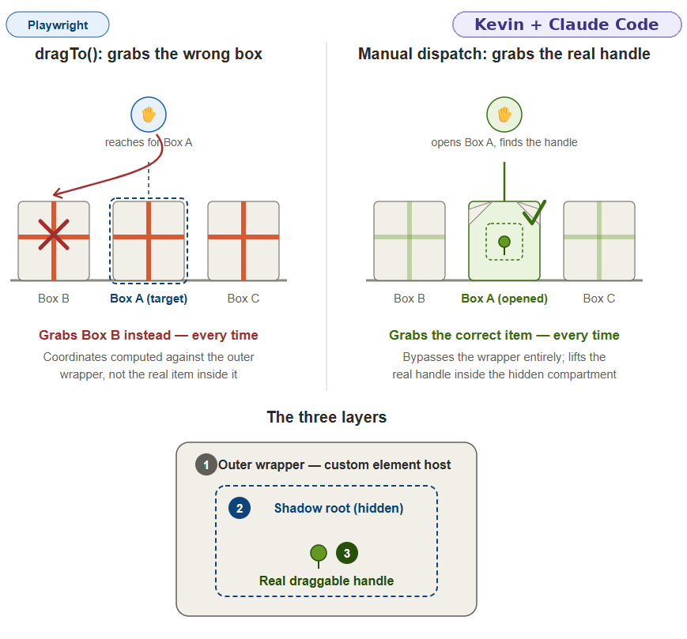

# Guide 2 (Draft): Playwright Test Plan

**Project:** Salesforce LWC Test Automation Portfolio (E-Bikes)
**Status:** ✅ Guest Suite and Internal Suite both verified against the live org (see [Guide 3](03-requirements-traceability.md) for per-requirement status)

---

## Overview

This plan targets the E-Bikes LWC sample app (Salesforce, Lightning Web Components + Experience Cloud) deployed per Guide 1. It's split into two suites by whether a test needs a logged-in session:

- **Guest Suite — Guest storefront.** Public Experience Cloud site. No auth needed.
- **Internal Suite — Internal Lightning app.** Requires a logged-in session via `storageState` (`auth.setup.ts`, see Guide 4).

Every test case below was checked against the actual E-Bikes source (`ProductController.cls`, the LWC components, and the sample data file) rather than assumed from the UI alone, since a few things about page size and component placement aren't obvious just from clicking around.

---

## Guest Suite — Guest Storefront

No login/session handling needed.

| # | Test | Why it matters | Notes from source |
|---|---|---|---|
| 1 | Product catalog loads; page 1 shows 9 products and a correct total-item count of 16; paging to page 2 shows the remaining 7 | Core smoke test — proves site, data, and LWC components work together | `ProductController.cls` hardcodes `PAGE_SIZE = 9`. **Do not** assert 16 tiles rendered at once — that will fail. Assert 9 tiles + `"16 items • page 1 of 2"` text from the `paginator` component, then click Next and assert 7 tiles + `"page 2 of 2"`. |
| 2 | Clicking a product opens its detail page with correct Name and MSRP | Verifies navigation + data binding, not just that a page loaded | The guest site's product detail view uses generic `forceCommunity:recordHeadline` + `recordHomeTabs` (standard Details/Related tabs) — **not** the custom `heroDetails`/`similarProducts`/`orderBuilder` components, which live only on the internal `Product_Record_Page`. Assert on the standard field values, not custom widgets. |
| 3 | Category filter narrows the catalog to the exact expected count | Tests real interactive logic, not static rendering | All filter checkboxes start checked (all products shown). Sample data gives exact expected counts: unchecking "Commuter" (leaving only "Mountain" checked) → **8** products (Dynamo×4 + Electra×4). Unchecking "Mountain" (leaving "Commuter") → **8** (Fuse×4 + Volt×4). |
| 4 | Level filter narrows the catalog to the exact expected count | Same as above, different filter dimension | Level "Beginner" → **8** (Fuse×4 + Volt×4), "Enthusiast" → **4** (Electra×4), "Racer" → **4** (Dynamo×4). |
| 5 | Search box narrows results by product name | Distinct interactive path from checkbox filters (free-text vs. facet) | `productFilter` has a `lightning-input type="search"` labeled "Search Key". Searching "FUSE" → 4 results. |
| 6 | Submitting "Create Case" as a guest succeeds and shows a confirmation toast | The most business-critical guest flow — this is how real customers report problems | Success toast text is hardcoded in `createCase.js`: title `"Case Created!"`, message `"You have successfully created a Case"`. Assert on that exact text. |
| 7 | Submitting "Create Case" with required fields empty shows inline validation and does not create a case | Cheap to add, catches a real regression class (broken required-field validation) | Uses `lightning-record-edit-form` — Salesforce renders its own inline field errors on failed submit; assert an error is shown and no success toast appears. Which fields are actually required depends on this org's field/page-layout config — confirm on first run rather than hardcoding a specific field name. |
| 8 | Guest sees a Login option and no authenticated-only content | Confirms guest sharing rules are enforced, not just that a button exists | The site does have `login`/`register`/`forgotPassword` routes deployed, so a Login entry point existing is likely — but whether it's visible in your header nav depends on Experience Builder config. **Confirm visually against the live deployed org before finalizing this locator.** |

---

## Internal Suite — Internal Lightning App

Needs a logged-in session — `auth.setup.ts` (Guide 4) solves that via the `sf` CLI frontdoor bridge, wired in as the `setup` project dependency for `chromium-internal`/`firefox-internal`/`webkit-internal`.

| # | TC | Test | Why it matters |
|---|---|---|---|
| A | TC-011 | A case submitted as a guest actually appears in the internal Case list | End-to-end proof the guest-facing flow reaches internal staff |
| B | TC-012 | Product Explorer loads real product data for an internal user | Confirms the internal Lightning app surface separately from the guest site |
| C | TC-013 | **Order Builder**: an internal user can build an order (select sizes/quantities via the `orderBuilder` component, backed by `Qty_S__c`/`Qty_M__c`/`Qty_L__c`) and it's reflected in `Order_Item__c` records | This is the actual mechanism behind "managing reseller orders" — the app's stated purpose — and is more central than a generic Product record edit. `orderBuilder` and `Order__c`/`Order_Item__c` have no guest sharing rules, so this is internal-only. Confirmed against the live org to be native HTML5 drag-and-drop (no "Add to Order" button); see `pages/OrderBuilderPage.ts` for the locator/interaction details. |
| D | TC-014 | An internal user can view/edit a Product record | Baseline CRUD coverage on the internal side |

---

## Suggested Structure

```
tests/
  auth.setup.ts                 ← Internal Suite login (sf CLI frontdoor bridge)
  guest-storefront.spec.ts      ← Guest Suite tests
  internal-app.spec.ts          ← Internal Suite tests
pages/
  ProductCatalogPage.ts         ← Guest Suite: catalog locators/actions (filters, search, pagination)
  ProductDetailPage.ts          ← Guest Suite: product detail assertions
  CreateCasePage.ts             ← Guest Suite: Create Case form + validation
  internalSession.ts            ← shared helper: reads the internal Lightning origin auth.setup.ts persists
  InternalCaseListPage.ts       ← Internal Suite: Case list view (TC-011)
  ProductExplorerPage.ts        ← Internal Suite: internal Product Explorer (TC-012)
  OrderBuilderPage.ts           ← Internal Suite: Reseller Order creation + drag-and-drop Order Builder (TC-013)
  ProductRecordPage.ts          ← Internal Suite: Product record view/edit (TC-014)
```

---

## Salesforce Changes Mitigation Strategy

Salesforce releases, LWC's rendering model, and the platform's own DOM quirks change things out from under a test suite that wasn't written defensively — a raw CSS selector, a hardcoded record Id, or a naive drag-and-drop call all break for different Salesforce-specific reasons. Each subsection below names the specific failure mode first, then the countermeasure actually used against it in this repo.

### Locator Strategy

**Failure mode:** raw CSS selectors and generated identifiers are the least stable things to anchor on in a Salesforce org. Salesforce record Ids (`Case.Id`, `Product__c.Id`, etc.) regenerate per org and per record, so any locator built on one breaks the moment a test creates fresh data. SLDS/Aura markup and CSS classes are also free to shift between Salesforce releases without any change to the LWC's actual behavior.

**Countermeasure:** prefer `page.getByRole()`, `getByText()`, `getByLabel()` over raw CSS selectors wherever the LWC markup allows it — locators anchored to accessible role/name/label are resistant to the superficial DOM changes a Salesforce release is likely to introduce, and never touch record Ids at all. A couple of spots below are flagged as needing live-org confirmation because the underlying LWC markup doesn't fully determine the rendered accessible name/role (e.g., whether the product tile's `<a>` gets an `href`, or the exact wording of a required-field error).

**Standing rule, made explicit here so every future page object follows it without having to rediscover it:** semantic locators come first, always. A CSS class selector is only acceptable as a documented last resort — for the specific case where a Salesforce/LWC element genuinely has no accessible role or name — and even then, the comment introducing it has to say so explicitly, so a class-based locator always reads as a deliberate exception, never a habit. Two examples already in this repo show what "documented last resort" looks like from each direction:

- `OrderBuilderPage.ts`'s quantity-save checkmark button has no accessible name at all, confirmed against the live org — `lightning-button-icon.save-button` is the fallback, documented as stable specifically *because* there's no better anchor, not because it was the first selector that happened to work.
- `ProductCatalogPage.ts`'s category/level filter checkboxes do have an accessible label via `getByLabel` — but SLDS renders a styled `span.slds-checkbox` on top that intercepts the click, and `force: true` doesn't fix it (see the Actionability rule below). The fix wasn't a CSS class fallback; `toggleCategoryFilter()`/`toggleLevelFilter()` click the visible label text instead, which is still a real semantic element, just a different one than the input. That's the rule working correctly even under pressure from a genuine actionability problem: reach for a different semantic locator before reaching for a CSS class.

A few locators in this repo predate this rule being written down (`.nav-info`, `.drop-zone`, `locator('th')`, `locator('..')`) and don't carry that kind of comment. They're not necessarily wrong — `.drop-zone`, for instance, anchors to deliberately stable custom markup, not generated SLDS styling — but they haven't been individually re-justified against this standard yet. Any *new* locator going forward needs the comment discipline the two examples above already have: state why a semantic locator wasn't available, not just that the CSS one worked.

### Actionability: No Bare Waits

**Failure mode:** `page.waitForTimeout(<n>)` encodes a guess about how long some invisible layout/animation/network settling takes — too short, and the flake just resurfaces the next time the org or CI runner is slower than the guess assumed; too long, and every run pays the full delay even when the real condition was already true. Playwright's built-in actionability checks (attached, visible, stable, receives events, enabled) already solve most of this automatically for actions like `.click()` — but they only check the specific element being acted on, not a surrounding container that's still resizing while that element already reads as stable. `OrderBuilderPage.ts`'s "New Reseller Order" modal was exactly this case: the Account combobox was already visible (its own `waitFor` had already passed), but the modal around it hadn't finished settling into its final position, so the typeahead dropdown that appears after typing could still intercept-then-vanish (reproduced on Firefox). The `page.waitForTimeout(500)` that used to sit here papered over that without ever confirming settlement actually happened.

**Countermeasure:** when there's a genuine settling condition Playwright's built-in actionability checks don't cover, wait on that condition explicitly instead of guessing a duration — `expect.poll()` (already used elsewhere in this file for WebKit's `waitForURL` gap on save) or a small purpose-built helper, never a bare timeout. `pages/actionability.ts`'s `waitForStableLayout()` polls a locator's own bounding box until two reads in a row match, and `OrderBuilderPage.gotoNew()` now calls it on the modal itself before touching the combobox — trading a guessed delay for an actual "has this stopped moving" check that fails loudly via `expect.poll`'s own timeout instead of silently running long or returning too early.

**Confirmed against the live org:** the original fixed delay was tuned against a Firefox-specific race confirmed once, empirically. This replacement has now had the same treatment — `TC-013` passed 5/5 on `--project=firefox-internal --repeat-each=5` against the live org, no flake.

### Shadow DOM Workaround: Accessing the Real Draggable Node

**The concept, in three doors:**

- **Door 1 — Light DOM. No barrier at all.** You speak your question directly at the door, and the person behind it answers verbally, right away. This is a normal `document.querySelector()` — it just asks, and gets a direct answer.
- **Door 2 — Open shadow root.** The door itself is shut, but it has a hatch — a specific, defined channel anyone can use to pass a note through and get one back. You can't just knock and talk normally anymore (`document.querySelector()` alone won't work), but anyone who knows to use the hatch (`element.shadowRoot`) can reach through it, no special permission required.
  - Playwright can pierce this automatically. Its own locators (`page.locator()`, `getByRole()`, plain CSS selectors) already know how to use the hatch on their own — no special code needed.
  - Playwright can also be manually driven through it, when you need something its high-level API doesn't offer — dropping into `page.evaluate()` and calling `element.shadowRoot.querySelector(...)` yourself, exactly what your Order Builder fix's `deepQueryAll` does.
- **Door 3 — Closed shadow root.** Same door, same hatch — but this hatch is locked, and no key exists on the outside at all. Only the person who lives behind the door (the component's own internal code, which privately holds the only key from the moment it was built) can ever use that hatch.
  - Playwright cannot pierce this — `element.shadowRoot` returns `null` for a closed root, for Playwright's locators and for manual `page.evaluate()` code alike. No sanctioned channel exists from the outside.
  - The only workaround is intercepting the door's construction itself — patching the browser's `attachShadow()` function before the component runs, to secretly force it open or capture a reference — a fragile, unofficial approach, not something Playwright supports natively.

**Failure mode:** Order Builder's `c-product-tile`/`c-order-item-tile` (TC-013) use genuine, native (open) shadow DOM — not LWC's usual synthetic-shadow polyfill. Playwright's built-in `locator.dragTo()` computes its drag coordinates against the custom element host (the visible "outer wrapper"), not the real draggable node hidden inside that element's shadow root — so it reliably grabs the wrong product tile, every time, regardless of which one is targeted.



**Countermeasure:** bypass the wrapper entirely rather than fighting it. The fix (`pages/OrderBuilderPage.ts:106-158`) uses a shadow-root-aware deep query (`deepQueryAll`) to walk into the tile's actual shadow root and find the real draggable node, then manually dispatches the native drag event sequence (`dragstart`/`dragenter`/`dragover`/`drop`/`dragend`) with one shared `DataTransfer` object across both the source and drop-zone nodes — mirroring exactly what a real browser drag does natively, just without relying on `dragTo()`'s coordinate-based targeting to find the right element first.

---

## Reporting & Diagnostics

Every test run captures a screenshot (pass or fail) and, on failure, video and a trace — see [Guide 5](05-visual-reporting-and-debugging.md) for the full config and the troubleshooting workflow (screenshot first, then `trace.zip` if that's not enough). This applies uniformly across both suites, not just Guest.

---

## Test Data Isolation: The FUSE X1 Concurrency Incident

A real, live-org-confirmed data-corruption bug, investigated after CI started failing in a way that initially looked unrelated across four different tests at once.

**Symptom:** `TC-013` (Order Builder), `TC-015` (API MSRP query), and `TC-027` (Accessibility Product Explorer scan) all started failing in the same CI runs — three tests in three different suites, with no code in common. `TC-014` (Product record edit) was failing too, but that looked like the odd one out rather than the actual cause.

**Root cause, confirmed via direct SOQL against the live org:** `Product__c` "FUSE X1" — a reference product `TC-013`/`TC-015`/`TC-027` all look up by that exact literal Name, for entirely unrelated reasons — had its Name field corrupted to `"FUSE X1Internal Suite edit check 1785652328240"`. `TC-014` is the only test in the whole suite that writes to `Product__c` at all: it edits the Description field, and something concatenated that edit's generated text onto Name instead.

The first theory (a Playwright locator matching the wrong field in the DOM) turned out to be wrong — scoping `ProductRecordPage.fieldInput()` to the edit modal specifically didn't stop it from recurring. The actual proof came from the corrupted value itself: **the timestamp embedded in the corrupted Name didn't match the timestamp in Description on the same record** — two different `Date.now()`-generated strings, meaning two *separate, overlapping executions* of `TC-014` had written to the same record concurrently. Most likely: a local verification run and the CI run it had just triggered, both hitting the same live personal Dev Edition org's `FUSE X1` record at the same time.

**Two separate fixes, addressing two separate risks:**
1. `.github/workflows/playwright.yml` got a `concurrency` guard so two GitHub Actions runs can never execute against the org simultaneously — confirmed to matter: two runs triggered back-to-back (a manual rerun overlapping an in-progress one) produced measurably broader, slower failures than either alone.
2. That guard does **not** cover a local run overlapping the CI run it just triggered — there's no way to prevent that from code alone, only by not running the local suite again immediately after pushing. Given that risk can't be fully eliminated, `TC-014` was moved to edit `FUSE X2` instead of `FUSE X1` — decoupling it from the three tests that depend on `FUSE X1`'s exact Name. This doesn't prevent the underlying race; it contains the blast radius to `TC-014` itself if it recurs, instead of cascading into three unrelated-looking failures. `TC-014` also now verifies via SOQL that its target record's Name is unchanged immediately after saving, so a recurrence fails loudly in the one test responsible rather than silently corrupting shared data.

**The general lesson, worth keeping in mind for any new test:** a record that gets *read* by many tests via a hardcoded literal name, and *written* by even one test, is a structural risk — not because the write test's logic is wrong, but because "many readers, one writer, shared live mutable state" is exactly the shape of bug that only shows up under conditions (timing, concurrency) that a single clean run won't reproduce. Preferring a dedicated, non-shared record for anything a test needs to mutate — the same instinct already applied elsewhere in this repo (the API Suite creates and deletes its own Case rather than touching a shared one) — avoids the whole class, not just this one instance of it.

**Confirmed a second time, after the fix landed — and from an unexpected direction.** `FUSE X1` was found corrupted again later, in a CI run using the *already-fixed* code (`TC-014` targeting `FUSE X2`, concurrency guard in place). The cause wasn't a new race in current code: two old, pre-fix commits had been manually rerun (to get a clean checkmark on old history) and then cancelled. Cancellation isn't instant — if `TC-014`'s old code was mid-edit against `FUSE X1` at that exact moment, the save can complete server-side just before the process actually stops, and a cancelled run reports neither pass nor fail, so nothing surfaced the corruption until the next unrelated run inherited it. Lesson on top of the lesson: rerunning old, pre-fix commits against a live shared org carries the same risk as the original bug, even when the rerun is immediately cancelled — restoring the record and moving on is the only real fix once it's happened, there's no way to make an old commit's rerun safe after the fact.

### Per-Test Data Creation (✅ Implemented on `experiment/per-test-data-isolation`, not yet merged to `main`)

`FUSE X2` contains the blast radius of the original bug, but it isn't a complete fix, and it has its own live side effect: **confirmed against the live org**, `FUSE X2`'s `Description__c` currently reads `"Internal Suite edit check 1785675423326"` — test-generated text, sitting on a real product in the public guest catalog, visible to anyone browsing the actual storefront right now. Solving that properly means not touching a real catalog product at all. The reasoning below is preserved close to how it actually happened, because the back-and-forth is the useful part, not just the ending.

1. **First idea: per-test fresh creation**, via direct REST `POST`/`DELETE` (`request.post('/services/data/.../sobjects/Product__c', ...)`), the same pattern the API Suite already uses for Case (`TC-016`–`018`, the one place in this repo that deletes what it creates rather than leaving it behind). This doesn't just contain the race the way `FUSE X2` does — it eliminates it, since two overlapping executions would each create their own distinctly-named record and never touch each other's data.
2. **Concern raised:** three real costs, not hypothetical ones — `Product__c`'s full required-field/validation-rule surface isn't trivial to satisfy via a raw REST call; a freshly created product might not be *discoverable* in Order Builder's own catalog UI immediately, for the same kind of search-index lag `REQ-CASE-001` already found for Case Numbers; and unlike Case, a leftover `Product__c` is guest-visible, so "leave it behind" (this repo's normal convention) would slowly pollute the real public catalog.
3. **Alternative proposed: one permanent, clearly-named fixture** (e.g. `"ZZZ-TEST-DO-NOT-USE"`), created once, used only by mutation-heavy tests — turning "verify discoverability" and "cleanup must be reliable" from a per-run cost into a one-time setup cost.
4. **Refinement, arguing back toward per-test creation:** if cleanup is reliable, visibility stops mattering — a product that exists for a few seconds during a passing test and is then deleted was never meaningfully exposed to a real guest.
5. **The actual gap in that argument, backed by this project's own history, not a hypothetical:** `afterEach`-style cleanup is not reliable specifically when a process is killed from *outside* Playwright's own control — which is exactly what caused the second `FUSE X1` corruption documented above (a cancelled CI run). That failure mode has already happened, more than once, in this exact repo. And when cleanup does fail, a randomly-named orphan (`Test Product 1785675423326-a8f3d`) is *less* recognizable as a mistake than a corrupted-but-familiar `FUSE X1` — nothing about the name signals "this shouldn't be here."

**Landing point — three distinct problems, three distinct, independently-scoped fixes, not one fix wearing three hats:**
- **Collision** (two executions racing on the same record) → per-test fresh creation, unique per run. `pages/productFixture.ts`'s `createTestProduct()`/`deleteTestProduct()`, mirroring the exact REST pattern `TC-016`–`018` already use.
- **Orphan-identifiability** (when cleanup fails, not if) → an unmistakable naming convention, `ZZZ-TEST-<timestamp>-<random>`, so an orphan is trivially sweepable later by name alone, independent of whether cleanup actually ran. Applied unconditionally, not just when a caller thinks they need it.
- **Discoverability** (the test's own ability to find the record it just created) — turned out to have a better fix than the `expect.poll()` retry originally proposed here: since the test already has the new record's Id from creating it via REST, `ProductRecordPage.gotoById()` navigates straight to `/lightning/r/Product__c/{id}/view` instead of searching a list view by name. No polling needed, because there's nothing to wait on — this sidesteps the risk entirely rather than retrying through it. (The retry-based approach remains the right one for a test that *doesn't* already have an Id in hand, like `REQ-CASE-001`'s Case-by-Number lookup.)

**Confirmed empirically before writing any implementation code, not assumed:** `sf sobject describe --sobject Product__c` — the only non-nillable creatable field is `OwnerId`, defaulted automatically; no validation rules exist on the object. Practically, only `Name` needs to be set. Separately, reading `ProductController.getProducts` in `ebikes-lwc`'s Apex source confirmed it's `@AuraEnabled(Cacheable=true scope='global')` — the method backing the Guest catalog, Order Builder, and Product Explorer's product lists. That's the concrete, source-backed reason `TC-012`/`TC-013` (which only *read* `FUSE X1`) were deliberately left unchanged rather than converted too: doing so would trade a solved problem (collision) for a real, confirmed-possible new one (cache-lag flakiness), for no safety benefit, since reads were already safe to share.

**The full audit — every remaining shared-record reference in the suite, decided upfront (principle 3), not left implicit:**

| Test | What it does with `FUSE X1`/`FUSE X2`/`Trailblazers` | Verdict |
|---|---|---|
| `TC-002` | Reads `FUSE X1`'s Name/MSRP in the guest catalog | Read-only shared — safe |
| `TC-012` | Reads `FUSE X1` via Product Explorer | Read-only shared — safe |
| `TC-013` | Reads `FUSE X1` to drag into a *new*, self-owned `Order__c`/`Order_Item__c` | Read-only shared — safe (the mutation is on its own new records, not `FUSE X1`) |
| `TC-015` | Reads `FUSE X1`'s MSRP via REST | Read-only shared — safe |
| `TC-025`/`TC-026` | Accessibility scans of pages showing `FUSE X1`/Order Builder | Read-only shared — safe |
| `TC-027` | Accessibility scan of `FUSE X1`'s record page | Read-only shared — safe |
| `TC-014` | **Edits** a Product's Description | The only writer — converted to per-test creation, above |

Only one row needed to change. This is what "test isolation as a default assumption" (principle 1) looks like applied honestly to a suite that mostly already had it — not a rewrite, an audit that found one real gap and closed it.

**Verified against the live org, not just locally reasoned about:** `--repeat-each=3` on `TC-014` produced 3 consecutive passes with zero `ZZZ-TEST-*` orphans left behind afterward (`sf data query`) — cleanup confirmed working end-to-end, not just in the happy-path single run.

---

## Next Guide

**Guide 3: Requirements Traceability** — maps each test case above to a tracked requirement ID and its live-org-verified status.

**Guide 4: Authentication & Test Session Strategy** — `auth.setup.ts` is built and verified, unblocking the Internal Suite's test file above.

**Guide 5: Visual Reporting & Trace Debugging** — screenshot/video/trace capture config and the troubleshooting workflow, applying to both suites.

