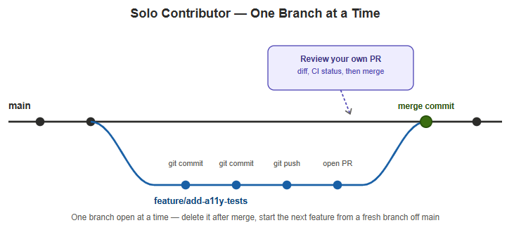

# Guide 8: Git Workflow (GitHub Flow)

**Project:** Salesforce LWC Test Automation Portfolio (E-Bikes)
**Status:** ✅ Branch protection configured and live on `main` — every change from here forward goes through a branch and a PR, gated on the `test` check passing.

---

## Overview

Every commit through Guide 7 landed directly on `main` via `git push`. That's a normal way to iterate solo, but it has a real cost visible in this repo's own history: several commits are followed by a "fix the thing that just broke" commit — CI ran and reported status, but nothing actually *gated* on it. `main` could, and did, end up broken between one push and the next.

[GitHub Flow](https://docs.github.com/en/get-started/using-github/github-flow) fixes that with one rule: work happens on a branch until it's actually done, and only merges into `main` once a PR is open and CI has passed. `main` stays deployable at every point in its history, not just eventually.

---

## What's Actually Configured

Branch protection on `main`, applied via the GitHub API (`PUT /repos/.../branches/main/protection`):

| Setting | Value | Why |
|---|---|---|
| `enforce_admins` | `true` | Applies to the repo owner too, not just hypothetical other contributors — a direct `git push origin main` is rejected by GitHub now, for anyone, no exceptions. |
| `required_pull_request_reviews.required_approving_review_count` | `0` | A PR is required before merging, but no approval count is enforced — merging your own PR once CI is green doesn't need a second reviewer. Deliberately not solved by fabricating one (see below). |
| `required_status_checks.contexts` | `["test"]` | The exact check-run name GitHub Actions reports for this workflow's `test` job (confirmed via `gh api repos/.../commits/{sha}/check-runs`) — a PR can't merge until it passes. |
| `required_status_checks.strict` | `false` | The branch doesn't need to be re-synced with `main` before merging — keeps friction low for solo work with no concurrent branches to conflict with. |
| `allow_force_pushes` / `allow_deletions` | `false` | `main` can't be force-pushed or deleted. |

**Deliberately not done:** fabricating a second contributor identity to make PRs look like they were reviewed by someone else. That would misrepresent the project's actual provenance — a solo project claiming multi-person review is a real problem if it ever came up in an interview, not a portfolio flex. Self-review (diff + CI status, then merge your own PR) is honest, normal for a solo repo, and exactly what `required_approving_review_count: 0` is configured for.

**One consequence, wired up right after this:** `.github/workflows/playwright.yml`'s `push` trigger was removed entirely — branch protection means the only thing that could ever push directly to `main`/`master` is a merge, already verified by its own PR run, so a separate push-triggered re-run was pure redundant load on the live org. It's not carried over to feature branches either: `pull_request`'s own `synchronize` event already re-runs CI on every commit pushed to an open PR, so a parallel `push` trigger there would just double-fire on every commit. CI now runs exactly once per meaningful event — a PR opening or getting a new commit — never on a bare push to any branch.

---

## The Workflow, Solo



```bash
git checkout -b feature/add-a11y-tests main
# ... commits ...
git push -u origin feature/add-a11y-tests
gh pr create --fill
# wait for the `test` check to pass
gh pr merge --squash --delete-branch
```

One branch open at a time, closed out (merged or abandoned) before the next one starts — not because GitHub Flow requires that specifically, but because with a single contributor there's no reason to have two features in flight competing for review attention.

---

## The Workflow, With Real Collaborators


The mechanism doesn't change with more contributors — each person still branches off `main`, commits freely, and merges via their own PR — but timing no longer needs to be sequential. Three people can have branches open at once, each merging whenever their own work and CI are ready, independent of what the others are doing. The one new case that shows up: if two branches edit the same lines of the same file, the *second* PR to merge is the one that sees the conflict (against the now-updated `main`), and resolving it is that contributor's job — pull the latest `main`, fix the conflict locally, push, then merge. The first PR to land never sees a conflict at all, regardless of which branch started first.

This repo has one contributor today, so this is the shape the workflow would take on if that changed — not a claim that it currently has multiple contributors.

---

## Next Guide

Nothing planned yet — this is currently the last guide.
