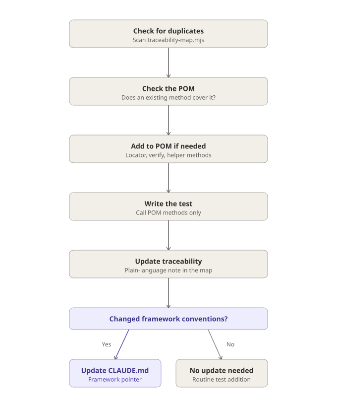
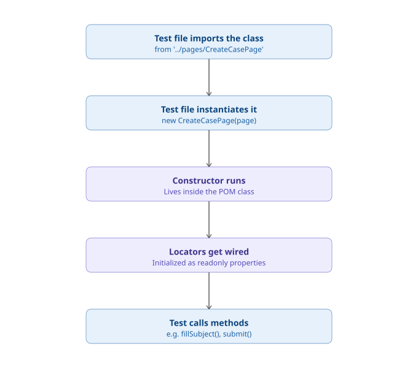

# Guide 7: POM Conventions & Test-Writing Workflow

**Project:** Salesforce LWC Test Automation Portfolio (E-Bikes)
**Status:** Active — reflects the working conventions Claude Code follows when adding new coverage

---

## Purpose

This guide documents two things: the **process** for adding a new test to this suite, and the **conventions** the Page Object Model (POM) code itself follows — grounded in the actual structure of `pages/CreateCasePage.ts` and `pages/productFixture.ts`, not abstract theory. It exists so that "how do I add a new test here" has one authoritative answer, for both human contributors and Claude Code sessions.

---

## The six-step workflow

Before adding a new requirement, this is the order of operations — each step exists to prevent a specific failure mode (duplicated coverage, raw selectors leaking into test files, an out-of-sync traceability map).



1. **Check for duplicates first** — scan `traceability-map.mjs` for existing requirements/tests that already cover roughly 80% of the new requirement before adding anything new.
2. **Check if the POM already has what's needed** — see if an existing locator or method on the relevant page class already covers it.
3. **If a new element is needed, add it to the POM:**
   - A locator (the "map")
   - Confirm the selector against the live org if it's non-obvious (the same discipline behind the `c-product-tile` locator comments — document *why* a locator was chosen, not just what it is)
   - Add any action/assertion-helper methods the test will need
4. **Write the test** in the corresponding `*.spec.ts` file, calling only POM methods — no raw selectors in the test file itself. Tag it with `{ tag: '@TC-###' }`; `REQ-####` IDs are intentionally *not* tagged in test code — they live only in `traceability-map.mjs`, keeping test files free of business-requirement references.
5. **Update `traceability-map.mjs`** with a short, plain-language note linking the new test to the requirement.
6. **Update `guides/` or `CLAUDE.md` only if this changed framework structure or conventions** — not for a routine test addition. Most new tests should touch nothing outside steps 1–5.

---

## How a POM class actually runs: constructor and instantiation

The workflow above describes *when* to touch a POM class. This section describes *what actually happens*, mechanically, every single time a test runs against one — regardless of whether the test file is brand new or has existed for months.



Using `CreateCasePage.ts` as the concrete example:

```typescript
import { CreateCasePage } from '../pages/CreateCasePage';

test('submitting with all fields filled succeeds', async ({ page }) => {
  const createCase = new CreateCasePage(page);
  await createCase.fillSubject('Brakes squeaking on FUSE X1');
  await createCase.submit();
  await createCase.expectSubmissionSucceeded({ subject: '...', description: '...' });
});
```

1. **The test file imports the class.** A plain TypeScript import — nothing runs yet.
2. **The test file instantiates it** — `new CreateCasePage(page)`. This is what actually triggers the constructor.
3. **The constructor runs**, inside the POM class itself:
   ```typescript
   constructor(page: Page) {
     this.page = page;
     this.subjectInput = page.getByLabel('Subject');
     this.descriptionInput = page.getByLabel('Description');
     this.priorityCombobox = page.getByLabel('Priority');
     this.reasonCombobox = page.getByLabel('Case Reason');
     this.submitButton = page.getByRole('button', { name: 'Submit' });
   }
   ```
4. **Locators get wired** — each `getByLabel`/`getByRole` call creates a `Locator` object and assigns it to a property, but **doesn't search the DOM yet**. A `Locator` is a lazy reference — the actual DOM lookup only happens later, the moment a method acts on it (`.fill()`, `.click()`). Every property is declared `readonly`, which is a compile-time lock: once wired in the constructor, TypeScript refuses to let any later code reassign it. Wired ≠ searched; wired = locked to a specific query, to be resolved on first use.
5. **The test calls methods** against those already-wired locators — `fillSubject()`, `submit()`, etc. This is the moment the DOM lookups the locators represent actually execute.

**This sequence is not a one-time initialization for the whole suite.** It runs fresh for every `new CreateCasePage(page)` call — in practice, once per test, since each test also gets its own fresh `page`. Ten existing tests in a spec file means this five-step sequence plays out ten separate times, not once.

**Ownership split, worth being precise about:** the wiring happens *inside the object being constructed*, not inside the test file. The test file only ever holds a reference to an already-wired object — it never touches the wiring process directly.

---

## What belongs in the POM vs. the test file

The recurring question when adding something new: *does this line describe **where** something is / **how** to touch it, or **what** the test is trying to prove?*

- **First answer → POM.** Locators, the mechanics of interacting with an element (including anything non-obvious, like `CreateCasePage.submit()`'s network-request interception, done because this app's UI success signal is unreliable — see Guide 3, REQ-CASE-002), and any specific value that's fixed regardless of which test calls it.
- **Second answer → test file.** The scenario, the specific input values chosen and *why* they matter for that scenario, and the assertion that defines success.

A POM method can still take a parameter (`fillSubject(value: string)`) — that doesn't move ownership. The POM still owns *how* to fill the field; the test still owns *what value* and *why*.

### One POM class, multiple UI units

"Page Object" doesn't strictly mean "one class per browser page." `ProductCatalogPage` and `ProductDetailPage` are two separate classes that both live on the **same** physical Product Explorer page — a master-detail split layout where selecting a tile updates a detail panel in place, not a new page load. Splitting them keeps each class focused on one coherent responsibility; a test composes only the units it actually needs.

---

## Locator and actionability standing rules

**Rule: semantic locators first, CSS class only as a documented last resort.**

Priority order, matching Playwright's own recommended approach:
1. **Role-based** (`getByRole`) — most resilient to markup changes, matches how assistive technology perceives the page.
2. **Label/text-based** (`getByLabel`, `getByText`, `getByPlaceholder`) — still semantic, tied to visible content.
3. **Test ID** (`getByTestId`) — explicit and stable, but requires the component author to add it. Not something we control on `ebikes-lwc` source.
4. **CSS/structural selector — last resort only, and always with a comment explaining why.**

An undocumented CSS selector is treated as a defect, not a shortcut. Example of a properly justified fallback, adapted from `CreateCasePage.expectValidationError()`:

```typescript
// CSS-fallback: no accessible role/label reaches the error state on this
// org's rendered form. Verified against the live DOM — semantic locators
// were not viable here.
await expect(this.page.locator('.slds-has-error, [data-error]').first()).toBeVisible();
```

**Rule: no bare `waitForTimeout`.** Use `expect.poll()` or Playwright's built-in `waitFor` instead — a fixed timeout either wastes time (waiting longer than necessary) or flakes (not waiting long enough). `ProductCatalogPage.expectTileCount()`'s use of `expect.poll()` — needed because the page-count text and the tile list update via two independent async paths — is the model to follow.

**Why this matters at scale, not just style:** a POM class centralizes a locator in one place. If a Salesforce release changes how an element renders, the fix is one line, in one file — every test using that page object inherits the fix automatically. Positional/CSS selectors scattered across many files turn the same platform change into a hunt across the whole suite.

---

**Rule: a confirmed real gap gets `test.fail()`, not silence.** If a requirement genuinely doesn't hold (see REQ-CASE-003, Guide 3), wrap the test in `test.fail()` rather than skipping or softening the assertion — it stays visible in the suite and flips to a regression signal if the gap is ever fixed.

## Further reading

For a broader overview of the Page Object Model pattern generally (not specific to this repo), see testomat.io's [Page Object Model in Playwright: JavaScript POM Guide](https://testomat.io/blog/page-object-model-pattern-javascript-with-playwright/).
